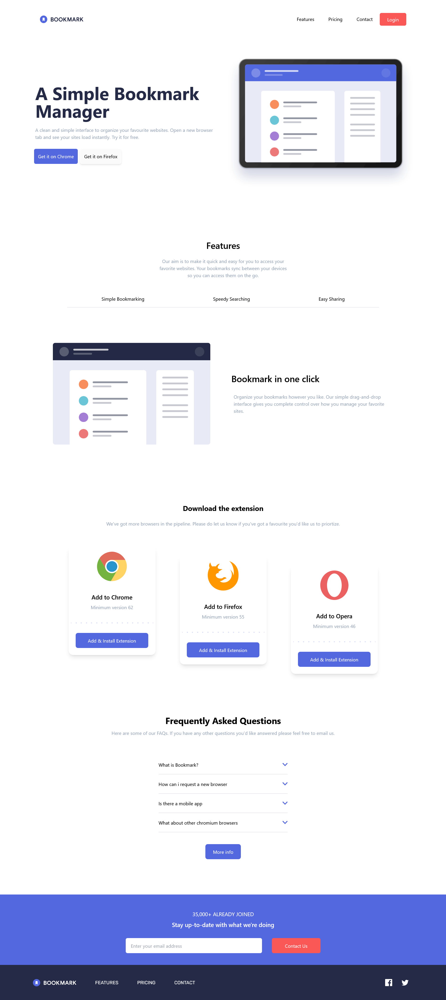

# Frontend Mentor - Bookmark landing page solution

This is a solution to the [Bookmark landing page challenge on Frontend Mentor](https://www.frontendmentor.io/challenges/bookmark-landing-page-5d0b588a9edda32581d29158). Frontend Mentor challenges help you improve your coding skills by building realistic projects. 

## Table of contents

- [Overview](#overview)
  - [The challenge](#the-challenge)
  - [Screenshot](#screenshot)
  - [Links](#links)
- [My process](#my-process)
  - [Built with](#built-with)
  - [What I learned](#what-i-learned)
  - [Continued development](#continued-development)
  - [Useful resources](#useful-resources)
- [Author](#author)

## Overview

### The challenge

Users should be able to:

- View the optimal layout for the site depending on their device's screen size
- See hover states for all interactive elements on the page
- Receive an error message when the newsletter form is submitted if:
  - The input field is empty
  - The email address is not formatted correctly

### Screenshot

### Links

- Solution URL: [Solution](https://www.frontendmentor.io/solutions/bookmark-landing-page-with-reacttypescript-and-tailwindcss-REXSBX8Gem)
- Live Site URL: [Website with vercel](https://bookmark-landing-page-utkukaanarasan.vercel.app/)

## My process

### Built with

- Tailwind CSS
- Flexbox
- Mobile-first workflow
- [React](https://reactjs.org/) - JS library

### What I learned

I learned working with svg's in React 

### Continued development

This project will be better with Next.js since this page definitely needs SEO. 

### Useful resources

- [tailwindcss docs](https://tailwindcss.com/docs/) - Looked everything related to tailwind from here.
- [Stackoverflow](https://stackoverflow.com/) - Whenever I get stuck this is the place that you can always find solution.
- [Google](https://google.com) - We all know it :)

## Author

- Website - [Utku Kaan Arasan](https://www.utkukaanarasan.com)
- Frontend Mentor - [@UtkuKaanArasan](https://www.frontendmentor.io/profile/UtkuKaanArasan)

